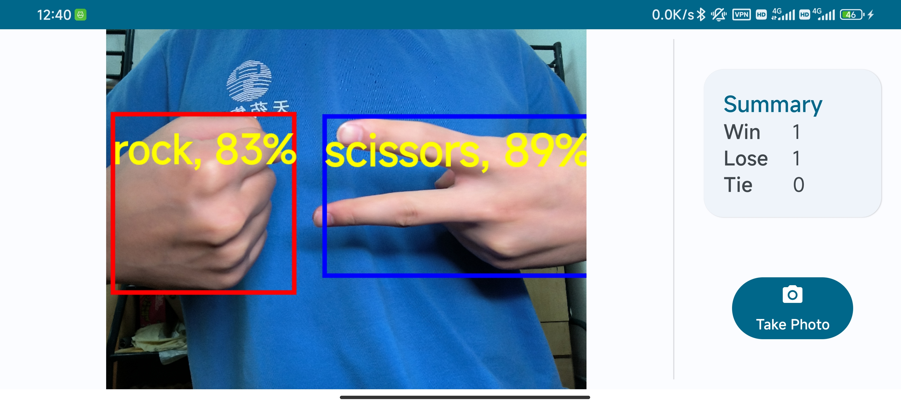
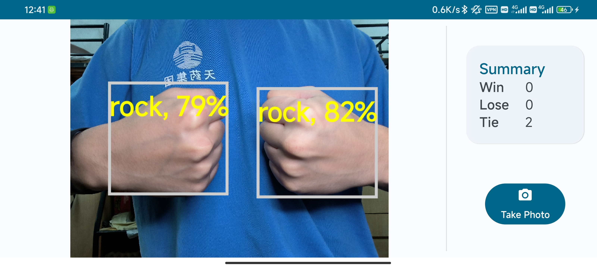
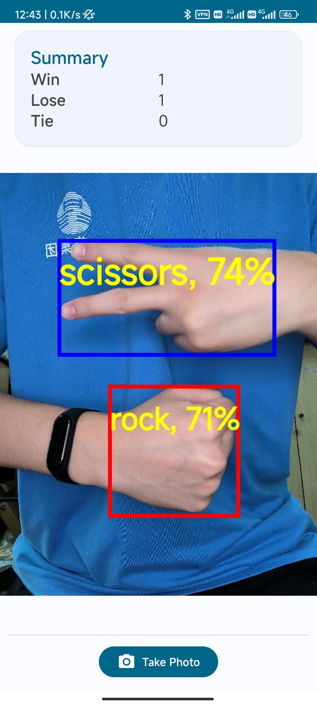

# RockPaperScissors

This Android App detects Rock Paper Scissors game results using a custom Tensorflow Lite object detection model and TFLite Task Library.

App insipred by Codelabs:  
[Build and deploy a custom object detection model with TensorFlow Lite (Android)](https://developers.google.com/codelabs/tflite-object-detection-android)  
[Train a salad detector with TensorFlow Lite Model Maker](https://github.com/googlecodelabs/odml-pathways/blob/main/object-detection/codelab2/python/Train_a_salad_detector_with_TFLite_Model_Maker.ipynb)  

# Preview

Testing environment:

    Device: Redmi K50
    Android API Level: 31(Android 12)

Red boxes for winners, blue boxes for losers, grey boxex for ties.

  

  

Here is a vertical screenshot.

  

 
